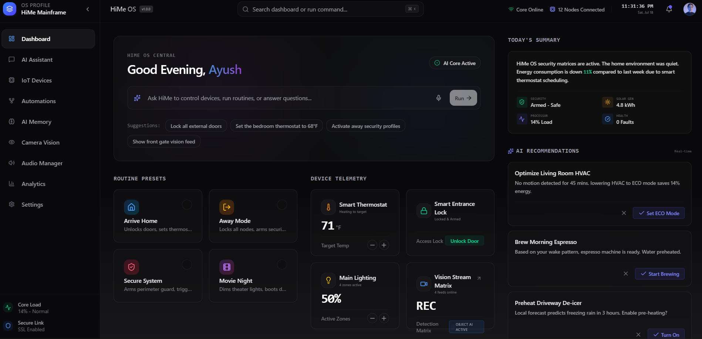
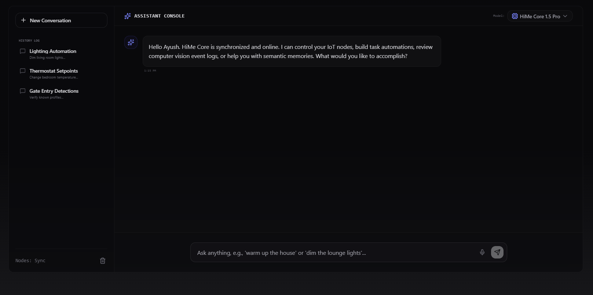

# HiMe OS

<p align="center">
  <h3 align="center">Your Personal AI Operating System</h3>
  <p align="center">
    An AI-powered operating system that unifies your digital life across your computer, phone, cloud services, and future smart devices.
  </p>
</p>

---

## 🚀 Overview

HiMe OS is an ambitious AI Operating System designed to become the central intelligence for a user's digital ecosystem.

Unlike traditional AI chatbots, HiMe OS aims to understand context, remember projects, automate workflows, interact with devices, and serve as a personal AI companion.

The long-term vision is to build an AI platform capable of connecting:

- 💻 Computers
- 📱 Mobile Devices
- ☁️ Cloud Services
- 🤖 AI Models
- 🏠 Smart Devices (IoT)
- 🎤 Voice Assistant
- 🧠 Long-term Memory
- ⚡ Automations

---

# Vision

HiMe OS is built around one simple idea:

> **One AI. Every Device. One Memory.**

Instead of switching between dozens of applications and AI assistants, users interact with a single intelligent operating system that understands their work, remembers context, and performs actions across multiple platforms.

---

# Current Status

Current Development Phase:

**Frontend MVP**

Completed:

- Modern Landing Page
- AI Dashboard UI
- Chat Interface
- Responsive Design
- Navigation
- Component Architecture

Upcoming:

- Backend APIs
- Authentication
- AI Engine
- Memory System
- Desktop Agent
- Mobile Companion
- Voice Assistant

---

# Features

## AI Assistant

- Natural conversations
- Context-aware responses
- Project understanding
- Long-term memory
- Multi-model AI support

---

## Device Control

HiMe OS is designed to control devices users already own.

Examples:

- Laptop
- Android Phone
- Smart TV
- Bluetooth Devices

Future Support:

- Smart Lights
- Smart Plugs
- Security Cameras
- Door Locks
- ESP32 Devices
- Raspberry Pi

---

## Desktop Agent

HiMe OS will communicate with a secure desktop agent capable of:

- Opening applications
- Launching VS Code
- Running terminal commands
- Searching files
- Monitoring system resources
- Managing projects

---

## Mobile Companion

The mobile application will provide:

- Voice Assistant
- Notifications
- Remote Device Control
- AI Chat
- Automation Management

---

## AI Memory

HiMe OS remembers:

- Conversations
- Projects
- Preferences
- Tasks
- Files
- Workflows

The goal is to eliminate repetitive prompting.

---

## Automation Engine

Example:

**"I'm going to study."**

HiMe OS can:

- Enable Focus Mode
- Open VS Code
- Launch GitHub
- Open Project
- Play Study Playlist
- Start Pomodoro Timer

---

# Planned Architecture

```
                +----------------+
                |   Frontend UI  |
                +--------+-------+
                         |
                REST / WebSocket
                         |
               +---------+----------+
               |      Backend       |
               +---------+----------+
                         |
        +----------------+----------------+
        |                |                |
   AI Engine        Memory Service    Auth Service
        |                |                |
        +----------------+----------------+
                         |
                  PostgreSQL Database
                         |
        +----------------+----------------+
        |                |                |
 Desktop Agent      Mobile App       IoT Devices
```

---

# Tech Stack

## Frontend

- React
- TypeScript
- Vite
- Tailwind CSS
- Shadcn UI

## Backend (Planned)

- Fastify
- TypeScript
- Prisma
- PostgreSQL
- Redis
- Socket.IO

## AI

- OpenAI
- Gemini
- Claude
- Local LLM Support

## Desktop

- Electron / Tauri
- Node.js

## Mobile

- Flutter

---

# Repository Structure

```
HiMe-OS/

├── frontend/
├── backend/
├── mobile/
├── desktop-agent/
├── shared/
├── docs/
├── architecture/
├── README.md
└── LICENSE
```

---

# Development Roadmap

## Phase 1

- [x] UI Design
- [x] Landing Page
- [x] Dashboard
- [x] Chat Interface

---

## Phase 2

- [ ] Backend Setup
- [ ] Authentication
- [ ] Database
- [ ] REST APIs

---

## Phase 3

- [ ] AI Engine
- [ ] Memory
- [ ] Context Management

---

## Phase 4

- [ ] Desktop Agent

---

## Phase 5

- [ ] Mobile Application

---

## Phase 6

- [ ] IoT Integration

---

## Phase 7

- [ ] Voice Assistant

---

# Installation

```bash
git clone https://github.com/Ayu5h576/HiMe-os.git

cd HiMe-os

npm install

npm run dev
```

---

# Why HiMe OS?

HiMe OS is not another chatbot.

It is an AI Operating System designed to become the intelligent layer between users, their devices, and modern AI models.

The objective is to provide one unified interface for productivity, automation, memory, and digital assistance.

---

# Future Goals

- AI Workspace
- Autonomous Task Execution
- Smart Device Integration
- Local AI Support
- Plugin Marketplace
- Team Collaboration
- Cross-platform Synchronization

---

# Screenshots

## Landing Page


---

## Dashboard



---

## AI Chat



# Contributing

Contributions, feature requests, and suggestions are welcome.

If you'd like to contribute:

1. Fork the repository
2. Create a feature branch
3. Commit your changes
4. Submit a Pull Request

---

# License

This project is currently under development.

A license will be added before the first stable public release.

---

# Author

**Ayush Rawat**

Computer Science Student • Full Stack Developer • UI/UX Designer

GitHub: https://github.com/Ayu5h576

---

## ⭐ Support

If you like this project, consider giving it a ⭐ on GitHub.

It motivates future development and helps others discover HiMe OS.
